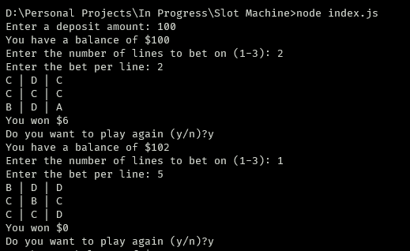
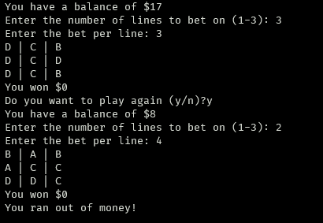

# Slot-Machine

A Simple Slot Machine CLI game build with Javascript

### About

- To play this game, user has to start by enter a `deposit amount`
- Then user can choose the `number of lines they can bet on`
- And the `bet per line`

If the user wins, the game will add the winning money to the balance. If he loses, `bet per line * number of lines they betted on` will be substracted from the balance.

##### Screens

###### Start and Winning

###### Losing and Running out of money

